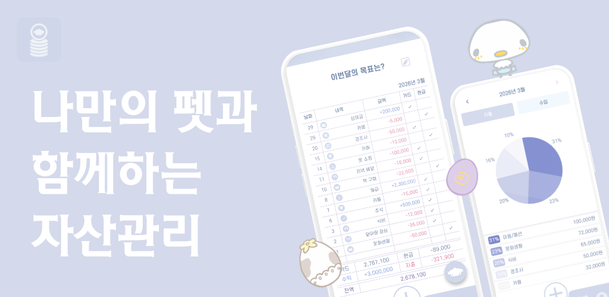
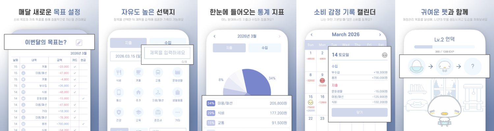

# :hatching_chick: 캐릭터 성장형 가계부: 레츠고 가계부:hatching_chick:

<p align="center">

</p>

> **"소비를 기록하면 캐릭터가 자라나는 즐거운 자산 관리 경험"**
> 지루한 가계부 쓰기를 게임처럼! 나의 소비 습관이 캐릭터의 성장 에너지가 됩니다.


<br>

## ✨ Introduction
<p align="center">


| 기능                 | 설명                                               |
| -------------------- | -------------------------------------------------- |
| `가계부 CRUD`        | 수입과 지출 기록 추가 및 수정, 삭제                  |
| `월별 목표 설정`     | 매월 1일 목표 달성 시 보상 지급                      |
| `일일 퀘스트`        | 일일 미션 완료 시 코인과 캐릭터 경험치 획득           |
| `통계 & 캘린더`      | 소비 패턴 확인 및 감정 등록                          |
| `캐릭터 상호작용`    | 귀여운 캐릭터와 직접 상호작용 가능                    |
| `캐릭터 수집 & 도감` | 캐릭터 성장 확인, 캐릭터 도감 및 새로운 캐릭터 획득 가능 |

<br>


## 📥 Download
<p align="left">
  <a href="https://play.google.com/store/apps/details?id=com.ag.letsgrowwallet">
    
  </a>
</p>


<br>


## 🛠 Tech Stack

<p>


</p>
</br>

<br>

## 🧑‍💻 Developer

| <br>[박가은](https://github.com/gaeunpark7) |
| :-----------------------------------------------------------------------------------------------------------------------------------: |

<br>


## :file_folder: Project Structure

```
lib/
├── app/
├── features/
│   ├── account_book/
│   │   ├── dashboard/
│   │   ├── transactions/
│   │   ├── stats/
│   │   └── calendar/
│   ├── gamification/
│   │   ├── character/
│   │   ├── shop/
│   │   └── quest/
│   ├── user/
│   │   ├── auth/
│   │   └── my_page/
│   └── shared/
│       ├── model/
│       ├── notifier/
│       └── service/
├── utils/
└── main.dart
```
